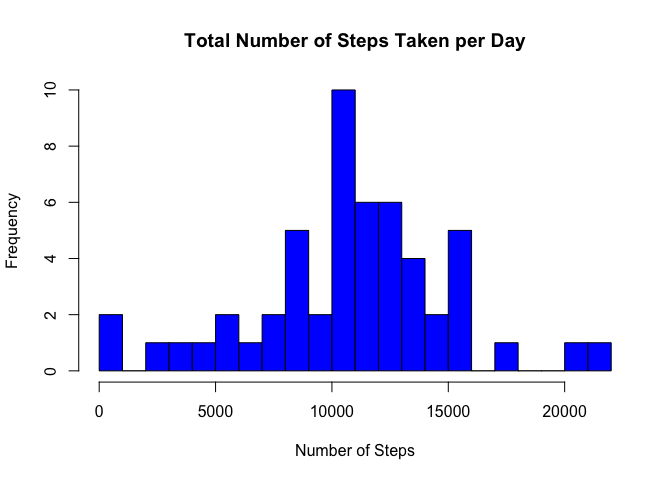
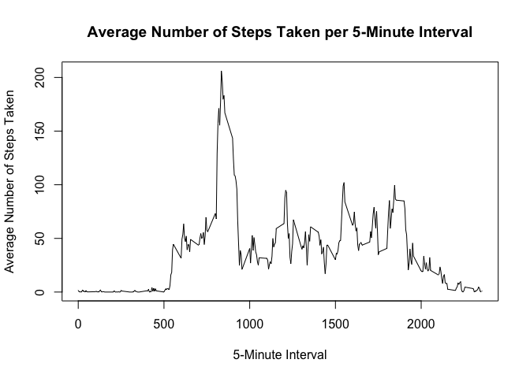
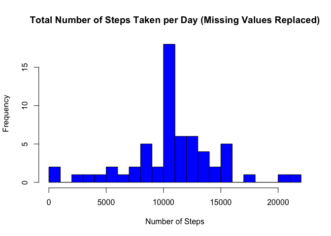
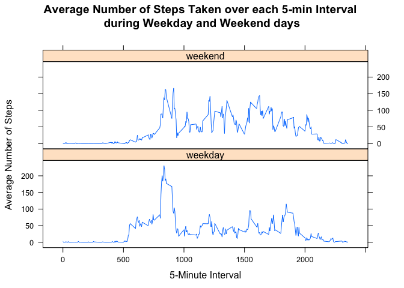

# Reproducible Research: Peer Assessment 1

## Background

It is now possible to collect a large amount of data about personal movement using activity monitoring devices such as a Fitbit, Nike Fuelband, or Jawbone Up. These type of devices are part of the “quantified self” movement – a group of enthusiasts who take measurements about themselves regularly to improve their health, to find patterns in their behavior, or because they are tech geeks. But these data remain under-utilized both because the raw data are hard to obtain and there is a lack of statistical methods and software for processing and interpreting the data.

This assignment makes use of data from a personal activity monitoring device. This device collects data at 5-minute intervals throughout the day. The data consists of two months of data from an anonymous individual collected during the months of October and November, 2012 and include the number of steps taken in 5-minute intervals each day.


## Loading and preprocessing the data

The following code reads the relevant data (*activity.csv*) from the zip file (*activity.zip*) in a forked/cloned version of the [Reproducible Research Peer Assessment 1 Repository](www.github.com/rdpeng/RepData_PeerAssessment1) into a data frame called *activity_data*. 

The following variables are included in the dataset:-

* *Steps*: Number of steps taken in a 5-minute interval (missing values are coded as NA)
* *Date*: The date on which the measurement was taken in YYYY-MM-DD format
* *Interval*: Identifier for the 5-minute interval in which measurement was taken

The column classes are specified as numeric (*steps*), character (*date*), and integer (*interval*) as they are read into the data frame and the missing values are specified as "NA". To preprocess the data in preparation for the remaining analyses, the **as.Date** function is used to change the *date* variable from character to date class. 


```r
zip_file <- "activity.zip"
activity_data <- read.csv(unzip(zip_file, "activity.csv"), 
                          na.strings = "NA", 
                          colClasses = c("numeric", "character", "integer"))
activity_data$date <- as.Date(activity_data$date, 
                              format = "%Y-%m-%d") 
```

## What is mean total number of steps taken per day?

The below histogram shows the total number of steps taken per day and indicates that the individual wearing the activity monitoring device most frequently took between 10000 and 11000 steps per day (10 times). On a couple of occasions, the individual only walked between 0 and 1000 steps, and at most walked between 20000 and 22000 steps.    

Before creating the histogram, the below code shows how the **aggregate** function was used to calculate the total number of steps taken per day. 


```r
total_steps_per_day <- aggregate(steps ~ date, 
                                 data = activity_data,
                                 sum)

hist(total_steps_per_day$steps, 
     main = "Total Number of Steps Taken per Day", 
     xlab = "Number of Steps", 
     col = "Blue", 
     breaks = 20)
```

<!-- -->


```r
mean_number_steps_per_day <- format(mean(total_steps_per_day$steps), 
                                    digits = 2, 
                                    nsmall = 2)

median_number_steps_per_day <- format(median(total_steps_per_day$steps), 
                                      digits = 2, 
                                      nsmall = 2)
```

The mean number of steps taken per day was 10766.19 and the median number of steps taken per day was 10765.00. These values are fairly similar, but with a slightly lower median value. This means that there is a very slight positive skew to the distribution of the data.


## What is the average daily activity pattern?

The time series plot below shows the average number of steps taken per 5-minute interval and indicates that on average, the individual wearing the activity monitoring device was most active (i.e. took more steps) between the 800-minute and 1000-minute intervals. They were least active between the 0-minute and 500-minute intervals and after the 2000-minute interval. This is likely to be when the individual was sleeping. 

Before creating the time series plot, the below code shows how the **aggregate** function was used to calculate the the average number of steps taken per 5-minute interval. 


```r
average_steps_per_interval <- aggregate(steps ~ interval, 
                                        data = activity_data, 
                                        mean, 
                                        na.action = na.omit)

plot(average_steps_per_interval$interval, average_steps_per_interval$steps, 
     type = "l", 
     main = "Average Number of Steps Taken per 5-Minute Interval", 
     xlab = "5-Minute Interval", 
     ylab = "Average Number of Steps Taken")
```

<!-- -->


```r
max_average_number_of_steps <- format(max(average_steps_per_interval$steps), 
                                      digits = 2, 
                                      nsmall = 2) 


interval_with_max_steps <- average_steps_per_interval[which(average_steps_per_interval$steps == max(average_steps_per_interval$steps)), ]
interval_with_max_steps <- interval_with_max_steps$interval
```

On average, the individual wearing with activity monitoring device took the most steps (206.17) during the 835-Minute interval. This is also shown in the time series plot above.  


## Imputing missing values


```r
number_of_rows_with_na <- sum(!complete.cases(activity_data))
```

Within the *activity_data* dataset, there are 2304 rows of data that are missing data (NA) and the below output shows that all of the missing values are in the *steps* column.    


```r
sapply(activity_data, 
       function(x) 
           sum(is.na(x)))
```

```
##    steps     date interval 
##     2304        0        0
```

The **na.aggregate** function from the [Zoo package](https://cran.r-project.org/web/packages/zoo/zoo.pdf) is used below to replace the missing step values (NA) with a simple replacement of the average number of steps taken during that 5-minute interval. 

First a new dataset is created (*activity_data_na_replaced*) by subsetting the *date* and *interval* columns from the original *activity_data* dataset. Then a new column is created (*steps*) which contains the steps values from the original dataset with all of the missing values (NA) replaced with the average number of steps for that 5-min interval. 


```r
library("zoo")

activity_data_na_replaced <- activity_data[,2:3]
activity_data_na_replaced$steps <- na.aggregate(activity_data$steps, 
                                                activity_data$interval, 
                                                FUN = mean)
```

The below histogram shows the total number of steps taken per day now that the missing values (NAs) have been replaced with the average number of steps taken during that 5-minute interval. If we compare this to the histogram created with missing values present in the dataset above, you will notice that the distributions are very similar with the exception of a greater frequency for the individual walking between 10,000 and 11,000 steps.  

Before creating the histogram, the below code shows how the **aggregate** function was used to calculate the total number of steps taken per day.


```r
total_steps_per_day_na_replaced <- aggregate(steps ~ date, data = activity_data_na_replaced, sum)

hist(total_steps_per_day_na_replaced$steps, 
     main = "Total Number of Steps Taken per Day (Missing Values Replaced)", 
     xlab = "Number of Steps", 
     col = "Blue", 
     breaks = 20)
```

<!-- -->


```r
mean_number_steps_per_day_na_replaced <- format(mean(total_steps_per_day_na_replaced$steps), 
                                                digits = 2, 
                                                nsmall = 2)

median_number_steps_per_day_na_replaced <- format(median(total_steps_per_day_na_replaced$steps), 
                                                  digits = 2, 
                                                  nsmall = 2)
```

The mean number of steps taken per day after missing values have been replaced was 10766.19 and the median number of steps taken per day was 10766.19. If we compare these values to the mean and median number of steps taken when missing data was still present in the data (10766.19 and 10765.00, respectively), we can see that the mean has remained the same and the median has increased and become equal to the mean. 

By imputing the average number of steps taken per 5-min interval in place of missing values, the median has converged with the mean. This has eliminated the slight skew in the distribution and transformed the data to be a symmetrical, normal distribution. 

## Are there differences in activity patterns between weekdays and weekends?

Using the *date* column from the *activity_data_na_replaced* dataset and the **weekdays** function, a new variable is created called *day*. This new variable is converted to a factor variable with seven levels (one representing each day of the week). In order to be able to compare weekday and weekend days, the seven levels of the *day* variable are changed into two levels (weekday and weekend) using the **revalue** function from the [plyr package](https://cran.r-project.org/web/packages/plyr/plyr.pdf).  


```r
library("plyr")

activity_data_na_replaced$day <- weekdays(activity_data_na_replaced$date)
activity_data_na_replaced$day <- as.factor(activity_data_na_replaced$day)
activity_data_na_replaced$day <- revalue(activity_data_na_replaced$day, 
                                                   c("Monday"="weekday", 
                                                     "Tuesday"="weekday", 
                                                     "Wednesday"="weekday", 
                                                     "Thursday"="weekday", 
                                                     "Friday"="weekday",
                                                     "Saturday"="weekend",
                                                     "Sunday"="weekend"))
```

The below panel plot was created using the [lattice package](https://cran.r-project.org/web/packages/lattice/lattice.pdf) and shows the average number of steps taken per 5-minute interval for weekend and weekday days. As shown by this plot, we can see that the individual wearing the activity monitor took the highest number of steps around the 800-minute interval (approx.) and that the average volume of steps taken was higher during this time period during weekdays. However, the individual tended to be more active between the 1,000 to 2,000 minute intervals at the weekends. Presumably, this may reflect the fact that the individual is at work and therefore be more sedentary in this time period during the weekdays. The fact that the individual is more active during the weekdays between the 500- and 800-minute intervals (approx.) compared to the weekends, is possibly another indication that they are getting up for work. 

Before creating the panel plot, the below code shows how the **aggregate** function was used to calculate the average number of steps taken per 5-minute interval during the weekend and weekday days. 


```r
average_steps_per_interval_for_each_day_type <- aggregate(steps ~ day + interval, 
                                                          data = activity_data_na_replaced, 
                                                          mean)

library("lattice")

xyplot(steps ~ interval | day, 
       data = average_steps_per_interval_for_each_day_type, 
       type = "l", 
       layout = c(1,2), 
       main = "Average Number of Steps Taken over each 5-min Interval \nduring Weekday and Weekend days",
       xlab = "5-Minute Interval",
       ylab = "Average Number of Steps")
```

<!-- -->

